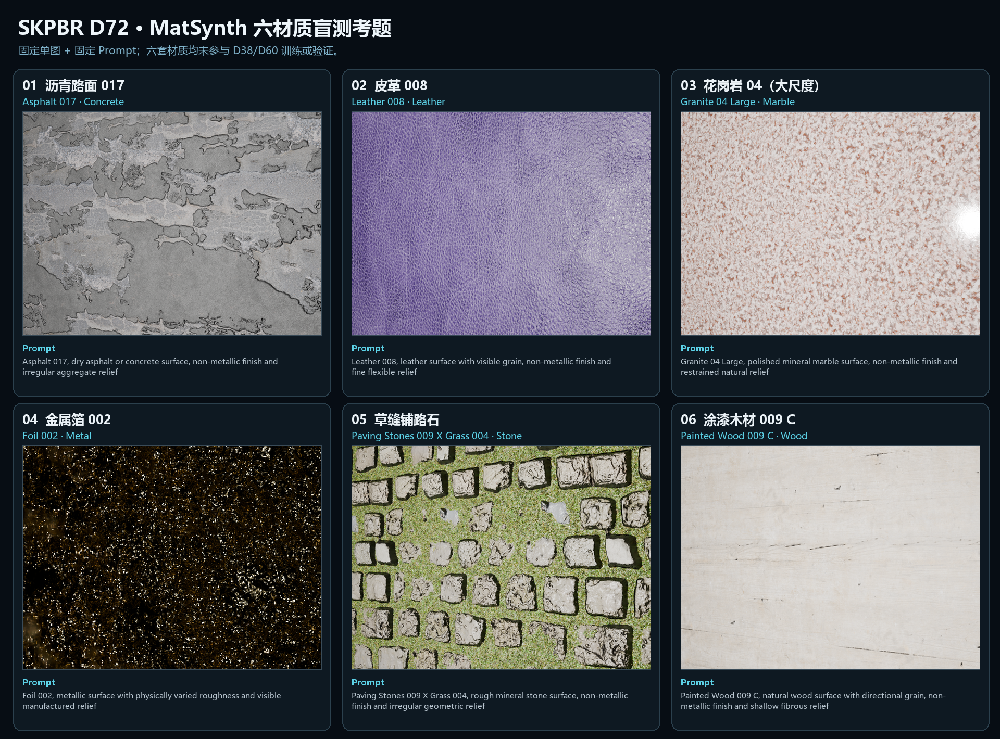

<div align="center">
  
</div>

<p align="center">
  <a href="#简体中文"><strong>简体中文</strong></a>
  &nbsp;·&nbsp;
  <a href="#english"><strong>English</strong></a>
  &nbsp;·&nbsp;
  <a href="docs/MODEL_CARD.md">Model Card</a>
  &nbsp;·&nbsp;
  <a href="examples/matsynth-90/README.md">MatSynth-90</a>
  &nbsp;·&nbsp;
  <a href="examples/matsynth-blind6/README.md">Blind-6</a>
  &nbsp;·&nbsp;
  <a href="LICENSE">Apache-2.0</a>
</p>

<p align="center">
  <code>IMAGE + TEXT · RESEARCH PREVIEW</code>
  &nbsp;&nbsp;
  <code>TEXT + SEED · EXPERIMENTAL</code>
  &nbsp;&nbsp;
  <code>5,652,218 PARAMS</code>
  &nbsp;&nbsp;
  <code>512 PX · 6 MAPS</code>
</p>

<div align="center">
  <a href="docs/assets/skpbr_v05_bright_studio_2x3.png">
    
  </a>
  <br>
  <sub>同一套 Cycles 灯光下的六组 Image + Text 输出，用来直观看材质类别与贴图响应。这里是跨版本视觉展示；当前 D72 的冻结后盲测在下方单独列出。</sub>
</div>

## 简体中文

SKPBR 是我拿来验证一件事的小模型：给它一张尽量平整的材质参考图，再补一句文字描述，能不能直接得到一套可以放进 Blender 或游戏引擎的 PBR 贴图。

当前 **v0.6 / D72** 有 **5,652,218 个参数**，输出六张 512px 贴图：BaseColor、Roughness、Metallic、OpenGL +Y Normal、Height 和 AO。

它现在有两条输入路径：

1. **图片 + 文字**：重建图片中可见的平面材质。这是目前更值得用的路径。
2. **纯文字 + Seed**：生成可复现的材质候选。能运行，但仍然是实验功能。

先把边界说清楚：SKPBR 还不是“随手拍一张照片就得到生产级材质”的扫描器。图片最好已经对齐、接近平面、曝光和光照比较克制；高密度纹理、复杂砖缝、细裂纹与纯文字结构仍然会失败。

### 90 材质能力验证（v0.5 历史记录）

我们从 MatSynth 中按元数据筛选了 90 个 CC0 材质，先导入 Blender 渲染统一的平面预览，再只把预览图和“类别 + 主色”短 Prompt 交给 SKPBR。模型没有读取或复制原始 PBR 贴图；90/90 项均生成成功，共输出 540 张 512px 贴图。

在 RTX 3060、CUDA、batch 4 下，模型加载完成后的整批处理耗时 **45.934 秒**，平均 **0.510 秒/材质**；计时包含图片读取、推理和结果写盘。完整输入、九张六贴图明细、逐项来源与限制说明见 **[MatSynth 90 材质能力验证 →](examples/matsynth-90/README.md)**。

### v0.6 改了什么

这一版没有继续往旧模型上堆空间纹理 Adapter，而是把图片模式改成更明确的物理解耦路径：

| 阶段 | 做了什么 |
|---|---|
| D69 | 先预测无光照 BaseColor、光照、高光 Mask、颜色边缘和几何边缘；高分辨率 RGB 细节经过门控后才能进入 BaseColor |
| D70–D71 | 用共享的多尺度物理分支恢复 Roughness、Metallic、Normal 和 Height；AO 主要由 Height/Normal 派生，再做小幅修正 |
| D72 | 加入仅 15,330 参数的全局安全门，在去光照 BaseColor 与 D57 锚点、派生 AO 与旧 AO 之间做置信度融合；Roughness、Metallic、Normal、Height 不被这个安全门改写 |

D72 在冻结的 128 项双域验证集上得到：BaseColor 线性 MAE **0.06524**、Roughness MAE **0.06778**、Metallic MAE **0.03992**、Normal 角度误差 **10.11°**、AO MAE **0.16637**、重渲染线性 MAE **0.06006**。这些数字只描述该验证集，不代表任意图片都能达到相同质量。

纯文字路径暂时沿用 D57 的确定性 Prompt + Seed 分支，所以 v0.6 的主要进步集中在图片 + 文字重建。

### 冻结后的 MatSynth Blind-6

D72 冻结后，我们先按元数据锁定六个不同类别的 MatSynth 材质，再统一渲染。模型只获得一张 512px RGB 图和 Prompt，目标六贴图只用于评分，也没有参与选权重。

[](examples/matsynth-blind6/README.md)

结果很有区分度：花岗岩、涂漆木材的几何比较稳，金属/非金属判断也稳定；金属箔在 BaseColor、Roughness、AO 上明显失败，草缝铺路石的结构和 Roughness 也没有还原好。六题宏平均为 BaseColor 线性 MAE **0.1912**、Roughness MAE **0.2399**、Normal 角度误差 **12.83°**、重渲染线性 MAE **0.1329**。完整题目、输出和逐项分数见 **[MatSynth Blind-6 →](examples/matsynth-blind6/README.md)**。

这六题已经用于诊断，下一轮不会拿它们训练或选模型。

<details>
<summary><strong>展开查看 v0.4 Blind-G 历史对照图</strong></summary>

这三张图是 v0.4 权重冻结后的旧盲测记录，只保留用于观察版本变化。

[](examples/blind-g/blind_g_best_01_02.png)

[](examples/blind-g/blind_g_best_03_04.png)

[](examples/blind-g/blind_g_representative_issues_01_02.png)

</details>

### 安装

需要 Python 3.10+ 和 PyTorch 2.2+。

```bash
python -m venv .venv
python -m pip install -e .
```

### 本地部署要求

下面说的是**推理**，不是训练。模型权重本身约 22.9MB，实际安装空间主要由 PyTorch 和 CUDA 运行库占用。

| 项目 | 实用建议 |
|---|---|
| 操作系统 | 64 位 Windows 10/11 或 Linux；当前发布机验证的是 Windows 11 |
| CPU | 可以只用 CPU 运行；建议使用较新的 64 位多核处理器 |
| 系统内存 | 建议至少 8GB；开发、批处理或并发请求建议 16GB |
| GPU | 可选；推荐 NVIDIA CUDA 显卡，512px 推理建议至少有 2GB 可用显存，4GB 以上更稳妥 |
| 硬盘 | CPU 环境建议预留约 2GB；CUDA 环境建议预留约 5GB，具体取决于 PyTorch 版本 |

本机 RTX 3060 的 D72 盲测中，第一次冷启动约 **9.09 秒**，模型加载后的单材质推理约 **0.60 秒**，峰值 reserved 显存约 **1.094 GiB**。纯文字分支更小，但仍会受显卡、驱动、PyTorch 版本和文件写入速度影响；这些是本机记录，不是所有机器的硬性保证。

- `--device auto` 检测到 CUDA 时使用显卡，否则回退到 CPU；CPU 可以运行，但会更慢。
- 推理本身不需要 Blender；Blender 只用于把输出贴图渲染成材质预览。
- 依赖和权重安装完成后可以离线推理，程序不会调用云端生成 API。
- 当前正式路径是 CPU 和 NVIDIA CUDA。AMD/Intel DirectML 与 Apple MPS 尚未纳入发布测试。
- 512px 是正式评估分辨率；提高分辨率或并发数量都会增加内存与显存占用。

### 图片 + 文字重建

```bash
skpbr \
  --image material.png \
  --prompt "斑驳灰色石砖，凹陷砖缝，干燥粗糙表面" \
  --output outputs/stone_brick
```

### 纯文字候选生成

```bash
skpbr \
  --prompt "带不规则绿色铜锈的氧化铜" \
  --seed 42 \
  --output outputs/copper_candidate
```

程序不会覆盖非空目录。输出包括 `preview.png`、`inference_manifest.json`，以及 `maps/` 里的六张贴图。`--device` 支持 `auto`、`cpu` 和 `cuda`。

模型是全卷积结构，但 **512px 是正式评估分辨率**。命令行允许实验 128–1024 之间、能被 16 整除的分辨率，这不等于这些分辨率已经达到相同质量。

### 当前能力边界

目前适合：

- 对齐的平面 RGB 材质局部；
- 中英文材质描述；
- 常见非 SSS 金属、涂层、石材、混凝土、砖石、陶瓷、复合材料、软木、皮革和织物；
- 用整数 Seed 复现纯文字候选。

目前不承诺：

- 未知光照、透视、曝光或遮挡下的任意手机照片；
- 不可见 UV 区域恢复；
- 透明、SSS、毛发、皮肤、液体和体积材质；
- 绝对物理反射率测量；
- 可靠还原所有高信息密度纹理，或仅靠文字生成准确的空间布局。

### 仓库里有什么

仓库只放推理代码、冻结的 v0.6 权重、测试、一个明亮棚拍展示、精简的历史评估图，以及 MatSynth-90 与冻结后 Blind-6 的公开展示。训练图、目标贴图、MatSynth 原始 PBR 贴图、商业材质库、缓存、优化器状态和内部报告不随仓库发布。

### 许可证

仓库自行创作的代码和导出的 SKPBR 权重使用 [Apache License 2.0](LICENSE)。公开 MatSynth 展示中的源预览来自逐项标记为 CC0 的子集；来源与许可见[第三方说明](docs/THIRD_PARTY.md)、[90 材质清单](examples/matsynth-90/materials.csv)和 [Blind-6 指标文件](examples/matsynth-blind6/benchmark.json)。

## English

SKPBR is a small model built around one practical question: can a mostly flat material reference, plus a short description, become a usable set of PBR maps for Blender or a game engine?

The current **v0.6 / D72** checkpoint has **5,652,218 parameters** and writes six 512px maps: BaseColor, Roughness, Metallic, OpenGL +Y Normal, Height, and AO.

It has two input paths:

1. **Image + text** reconstructs the visible planar material patch. This is the useful path today.
2. **Text + seed** generates a repeatable material candidate. It runs, but it remains experimental.

The boundary matters: SKPBR is not yet a “casual phone photo in, production material out” scanner. The image should be aligned, close to planar, and reasonably controlled in exposure and lighting. Dense veins, cracks, brick layouts, and text-only spatial structure can still fail.

### 90-material capability check (historical v0.5 run)

We selected 90 MatSynth materials whose metadata reports CC0, imported them into Blender to render consistent planar previews, and gave SKPBR only each preview plus a short category-and-color Prompt. The model did not read or copy the original PBR maps. All 90 items completed, producing 540 maps at 512px.

On an RTX 3060 with CUDA and batch 4, the warm-model batch took **45.934 seconds**, or **0.510 seconds/material**, including image reads, inference, and output writes. See the **[MatSynth 90-material capability check →](examples/matsynth-90/README.md)** for the inputs, nine detailed six-map sheets, per-item provenance, and limitations.

### What changed in v0.6

The image path now separates observable appearance before predicting the PBR maps instead of stacking another spatial texture adapter on the old model.

| Stage | Change |
|---|---|
| D69 | predicts de-lit BaseColor, illumination, specular, color-edge, and geometry-edge masks; high-resolution RGB details enter BaseColor through a learned gate |
| D70–D71 | reconstructs Roughness, Metallic, Normal, and Height with a shared multiscale physical decoder; AO is primarily derived from Height and Normal with a bounded correction |
| D72 | adds a 15,330-parameter global safety gate between the de-lit BaseColor and D57 anchor, and between derived AO and the previous AO; it leaves Roughness, Metallic, Normal, and Height unchanged |

On the frozen 128-row dual-domain validation set, D72 records 0.06524 linear BaseColor MAE, 0.06778 Roughness MAE, 0.03992 Metallic MAE, 10.11° Normal angular error, 0.16637 AO MAE, and 0.06006 linear rerender MAE. These figures describe that validation set, not arbitrary photographs.

The text-only path still uses the frozen deterministic D57 Prompt + seed branch, so v0.6 mainly advances image + text reconstruction.

### Post-freeze MatSynth Blind-6

After D72 was frozen, six distinct material categories were locked from metadata and rendered under one Blender setup. Inference received one 512px RGB image and one prompt. Target maps were used only for scoring and never for checkpoint selection.

[](examples/matsynth-blind6/README.md)

Granite and painted wood retain geometry comparatively well and non-metal classification is stable. Foil fails badly in BaseColor, Roughness, and AO; paving stones with grass also lose structure and roughness. Macro results are 0.1912 linear BaseColor MAE, 0.2399 Roughness MAE, 12.83° Normal angular error, and 0.1329 linear rerender MAE. See **[MatSynth Blind-6 →](examples/matsynth-blind6/README.md)** for every output and score.

These six cases are now diagnostic-only and will not be used for further training or model selection.

<details>
<summary><strong>Expand the historical v0.4 Blind-G boards</strong></summary>

These are retained only as version-history references.

[](examples/blind-g/blind_g_best_01_02.png)

[](examples/blind-g/blind_g_best_03_04.png)

[](examples/blind-g/blind_g_representative_issues_01_02.png)

</details>

### Install

Python 3.10+ and PyTorch 2.2+ are expected.

```bash
python -m venv .venv
python -m pip install -e .
```

### Local deployment requirements

The figures below describe **inference**, not training. The checkpoint itself is about 22.9MB; PyTorch and the CUDA runtime account for most of the installed size.

| Item | Practical guidance |
|---|---|
| Operating system | 64-bit Windows 10/11 or Linux; the current release machine is Windows 11 |
| CPU | CPU-only inference is supported; a recent 64-bit multicore processor is recommended |
| System memory | 8GB recommended; 16GB for development, batching, or concurrent requests |
| GPU | Optional; NVIDIA CUDA is recommended, with at least 2GB of free VRAM for 512px inference and 4GB+ for comfortable headroom |
| Disk | Reserve about 2GB for a CPU environment or 5GB for a CUDA environment, depending on the PyTorch build |

In the local RTX 3060 D72 blind run, the first cold request took about **9.09 seconds**, warm single-material inference took about **0.60 seconds**, and peak reserved VRAM was about **1.094 GiB**. The text-only branch is smaller. GPU, driver, PyTorch build, and file I/O still affect these figures; they are measurements, not hard requirements.

- `--device auto` uses CUDA when available and otherwise falls back to CPU. CPU works, but is slower.
- Blender is not required for inference; it is only needed to render the output maps as a material preview.
- Once dependencies and weights are installed, inference can run offline and does not call a cloud generation API.
- The released paths are CPU and NVIDIA CUDA. AMD/Intel DirectML and Apple MPS are not part of the current test matrix.
- 512px is the evaluated resolution. Higher resolutions and concurrent requests increase memory and VRAM use.

### Image + text reconstruction

```bash
skpbr \
  --image material.png \
  --prompt "mottled gray stone brick with recessed joints and a dry rough finish" \
  --output outputs/stone_brick
```

### Text-only candidate generation

```bash
skpbr \
  --prompt "oxidized copper with irregular green patina" \
  --seed 42 \
  --output outputs/copper_candidate
```

The command refuses to overwrite a non-empty directory. It writes `preview.png`, `inference_manifest.json`, and six images under `maps/`. `--device` accepts `auto`, `cpu`, and `cuda`.

The network is fully convolutional, but **512px is the evaluated release resolution**. Other multiples of 16 from 128 to 1024 are exposed for experiments, not as a quality promise.

### Current boundary

Reasonable research-preview use:

- aligned planar RGB material crops;
- English or Chinese material descriptions;
- common non-SSS metals, coatings, stone, concrete, masonry, ceramic, composites, cork, leather, and textiles;
- deterministic text-only candidates through an integer seed.

Not established:

- arbitrary phone photos with unknown lighting, perspective, exposure, or occlusion;
- hidden UV recovery;
- transparency, SSS, hair, skin, liquids, or volumes;
- absolute physical reflectance measurement;
- reliable recovery of every high-information texture or accurate spatial layouts from text alone.

### What is published

The repository contains inference code, the frozen v0.6 checkpoint, tests, one bright studio gallery, compact historical evaluation images, and public MatSynth-90 plus post-freeze Blind-6 displays. Training images, target maps, original MatSynth PBR maps, commercial material libraries, caches, optimizer states, and internal reports are not distributed.

### License

Repository-authored code and the exported SKPBR checkpoint use the [Apache License 2.0](LICENSE). Source-preview portions in the public MatSynth displays derive from subsets whose per-item metadata reports CC0; see the [third-party notice](docs/THIRD_PARTY.md), [90-item manifest](examples/matsynth-90/materials.csv), and [Blind-6 benchmark file](examples/matsynth-blind6/benchmark.json).
