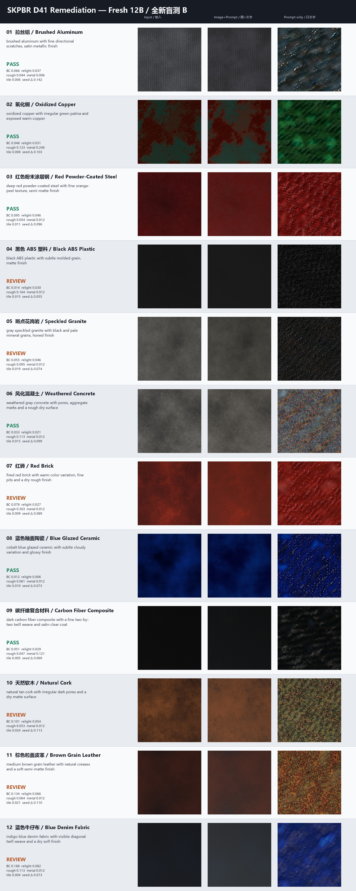

# SKPBR

[English](#english) · [简体中文](#简体中文)

## English

SKPBR is my small attempt at turning a material reference into something you can actually plug into Blender or a game engine. The current v0.2 checkpoint has **4,042,230 parameters** and writes six 512px PBR maps:

- BaseColor
- Roughness
- Metallic
- OpenGL +Y Normal
- Height
- AO

There are now two inputs:

1. **Flat image + text** — reconstruct the visible material patch. This is the useful path today.
2. **Text + seed** — generate a repeatable material candidate. This path runs, but it is still experimental.

I'll say the awkward part first: this is not yet a general “one phone photo in, production material out” system. The image path expects an aligned, fairly flat material crop with manageable lighting. Text-only generation failed its final release gate, so please treat those results as starting points rather than ground truth.

### What the latest blind test looks like

This sheet contains twelve procedural materials generated only after the weights were frozen. Each row compares the input-side target with the current result. It is deliberately not a cherry-picked beauty reel.



The image-plus-text path is already useful for metals, coatings, concrete, ceramic, and several stone-like surfaces. Dark leather, denim, cork, brick roughness, and some ABS finishes still need work. The same-material color test passed red, blue, and orange, but missed white; [the four-color sheet is here](examples/plane-d41/same_material_color_b_contact_sheet.jpg).

### Numbers worth knowing

| Check | Result | Status |
|---|---:|---|
| Parameters | 4,042,230 | — |
| Frozen D10 BaseColor MAE | 0.04967 | pass, ceiling 0.10 |
| Frozen D10 Roughness MAE | 0.06145 | pass |
| Frozen D10 Metallic MAE | 0.00455 | pass |
| Frozen D10 Normal error | 13.68° | pass |
| Frozen D10 rerender MAE | 0.03702 | pass |
| Catastrophic metal/non-metal swaps | 0 | pass |
| Fresh-12B combined identities | 6 / 12 | fail, required 8 |
| Same material, four colors | 3 / 4 | white failed |
| Peak training VRAM estimate | 5.07 GiB | below the 8 GiB cap |

The D10 set contains 81 held-out examples. Fresh-12B is a second one-shot suite created after the Prompt adapter was frozen; it was not used for another tuning round. The complete methodology and per-material table are in the [D38-D41 technical report](docs/evaluation/SKPBR_D38_D41_Technical_Report.html).

### Install

Python 3.10+ and PyTorch 2.2+ are expected.

```bash
python -m venv .venv
python -m pip install -e .
```

### Image + text reconstruction

```bash
skpbr \
  --image material.png \
  --prompt "weathered gray concrete with pores, rough dry finish" \
  --output outputs/concrete
```

### Text-only candidate generation

```bash
skpbr \
  --prompt "oxidized copper with irregular green patina" \
  --seed 42 \
  --output outputs/copper_candidate
```

The command refuses to overwrite a non-empty directory. It writes `preview.png`, `inference_manifest.json`, and six images under `maps/`. CPU and CUDA are supported through `--device auto`, `--device cpu`, or `--device cuda`.

The model is fully convolutional, but **512px is the evaluated release resolution**. Other multiples of 16 from 128 to 1024 are exposed for experiments, not as a quality promise.

### Current boundary

Supported as a research preview:

- aligned planar RGB material crops;
- English or Chinese material descriptions;
- common non-SSS metals, coatings, stones, concrete, masonry, ceramic, composites, cork, leather, and textiles;
- deterministic text-only variations through an integer seed.

Not established yet:

- arbitrary phone photos with unknown lighting, perspective, exposure, or occlusion;
- hidden or unseen UV recovery;
- transparency, subsurface scattering, hair, skin, liquids, or volumes;
- physically measured absolute reflectance;
- reliable text-only material identity across all covered classes.

### What is published

The repository contains inference code, the frozen v0.2 checkpoint, tests, the twelve-material blind sheet, aggregate evaluation evidence, and the previous v0.1 historical audit. It does **not** contain commercial material assets, source PBR libraries, training images, private caches, optimizer states, sample identities, or nearest-neighbor catalogs.

### License

Repository-authored code and the exported SKPBR checkpoint are released under the [Apache License 2.0](LICENSE). That license does not grant redistribution rights for third-party source assets; none of those assets are included here.

## 简体中文

SKPBR 是我把材质参考图变成 Blender 或游戏引擎里能直接用的 PBR 贴图的一次小实验。现在的 v0.2 模型有 **4,042,230 个参数**，会输出六张 512px 贴图：BaseColor、Roughness、Metallic、OpenGL +Y Normal、Height 和 AO。

这一版支持两种输入：

1. **平面图片 + 文字**：重建图片里可见的材质。这是目前真正能用的主路径。
2. **只输入文字 + Seed**：生成一套可以复现的材质候选。它已经能跑，但仍然属于实验功能。

先把不好听的话说在前面：它还不是“随便拍张手机照片就能得到生产级材质”的系统。图片最好是对齐、比较平整、光照可控的材质局部。纯文字生成也没有通过最后一道发布门槛，所以更适合拿来做起点，不适合当成标准答案。

### 最新一轮盲测

下面是权重冻结后才生成的 12 种程序化材质。每一行都在比较输入侧目标和当前输出，没有特意只挑好看的结果。


目前图像 + 文字模式在金属、涂层、混凝土、陶瓷和一部分石材上已经有使用价值。深色皮革、牛仔布、软木、红砖 Roughness 和部分 ABS 表面仍然比较弱。同材质异色测试中红、蓝、橙通过，白色失败；[四色对比图在这里](examples/plane-d41/same_material_color_b_contact_sheet.jpg)。

### 几个关键数字

| 检查项 | 结果 | 状态 |
|---|---:|---|
| 参数量 | 4,042,230 | — |
| 冻结 D10 BaseColor MAE | 0.04967 | 通过，上限 0.10 |
| 冻结 D10 Roughness MAE | 0.06145 | 通过 |
| 冻结 D10 Metallic MAE | 0.00455 | 通过 |
| 冻结 D10 Normal 角度误差 | 13.68° | 通过 |
| 冻结 D10 重渲染 MAE | 0.03702 | 通过 |
| 金属/非金属灾难性互换 | 0 | 通过 |
| Fresh-12B 综合身份通过数 | 6 / 12 | 未通过，要求 8 |
| 同材质四色 | 3 / 4 | 白色失败 |
| 训练峰值显存估算 | 5.07 GiB | 低于 8 GiB 限制 |

D10 是 81 个冻结测试样本。Fresh-12B 是 Prompt 适配器冻结后才生成的第二套一次性测试，失败后没有继续拿它调参。完整方法和逐材质数据见 [D38-D41 技术报告](docs/evaluation/SKPBR_D38_D41_Technical_Report.html)。

### 安装

需要 Python 3.10+ 和 PyTorch 2.2+。

```bash
python -m venv .venv
python -m pip install -e .
```

### 图片 + 文字重建

```bash
skpbr \
  --image material.png \
  --prompt "带孔洞的风化灰色混凝土，干燥粗糙表面" \
  --output outputs/concrete
```

### 纯文字候选生成

```bash
skpbr \
  --prompt "带不规则绿色铜锈的氧化铜" \
  --seed 42 \
  --output outputs/copper_candidate
```

程序不会覆盖非空目录。输出包括 `preview.png`、`inference_manifest.json`，以及 `maps/` 目录里的六张贴图。可以使用 `--device auto`、`--device cpu` 或 `--device cuda`。

模型本身是全卷积结构，但**这一版正式评估的分辨率是 512px**。命令行允许实验 128 到 1024 之间、能被 16 整除的分辨率，但这不代表它们已经达到同样的质量。

### 当前能力边界

目前可以作为研究预览使用的范围：

- 对齐的平面 RGB 材质局部；
- 中英文材质描述；
- 常见非 SSS 金属、涂层、石材、混凝土、砖石、陶瓷、复合材料、软木、皮革和织物；
- 通过整数 Seed 复现纯文字候选。

尚未证明的范围：

- 未知光照、透视、曝光或遮挡下的任意手机照片；
- 不可见 UV 区域的恢复；
- 透明、次表面散射、毛发、皮肤、液体和体积材质；
- 绝对物理反射率测量；
- 在所有已覆盖类别上都可靠的纯文字材质生成。

### 仓库里有什么

仓库包含推理代码、冻结的 v0.2 权重、测试、12 材质盲测图、汇总评估数据，以及 v0.1 的历史审计。仓库不包含商业材质资产、源 PBR 库、训练图片、私有缓存、优化器状态、样本身份或近邻检索目录。

### 许可证

仓库自行创作的代码和导出的 SKPBR 权重使用 [Apache License 2.0](LICENSE)。这个许可证不会自动授予第三方源素材的再分发权；这类素材没有放进仓库。
