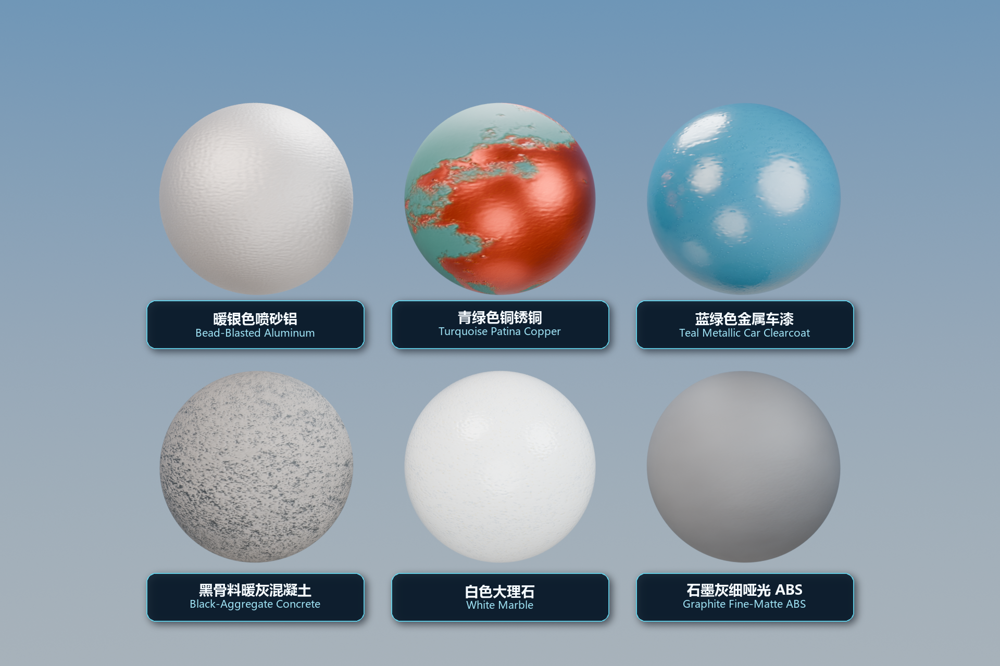

<div align="center">
  
</div>

<p align="center">
  <a href="#english"><strong>English</strong></a>
  &nbsp;·&nbsp;
  <a href="#简体中文"><strong>简体中文</strong></a>
  &nbsp;·&nbsp;
  <a href="docs/MODEL_CARD.md">Model Card</a>
  &nbsp;·&nbsp;
  <a href="LICENSE">Apache-2.0</a>
</p>

<p align="center">
  <code>IMAGE + TEXT · MVP</code>
  &nbsp;&nbsp;
  <code>TEXT + SEED · EXPERIMENTAL</code>
  &nbsp;&nbsp;
  <code>4,586,975 PARAMS</code>
  &nbsp;&nbsp;
  <code>512 PX · 6 MAPS</code>
</p>

<div align="center">
  <a href="docs/assets/skpbr_v04_six_material_spheres.png">
    
  </a>
  <br>
  <sub>Six Image + Text reconstructions rendered in Blender · Blender 中的 6 组 Image + Text 材质重建</sub>
</div>

## English

SKPBR is my small attempt at turning a material reference into something you can actually plug into Blender or a game engine. The current v0.4 checkpoint has **4,586,975 parameters** and writes six 512px PBR maps:

- BaseColor
- Roughness
- Metallic
- OpenGL +Y Normal
- Height
- AO

There are now two inputs:

1. **Flat image + text** — reconstruct the visible material patch. This is the useful path today.
2. **Text + seed** — generate a repeatable material candidate. This path runs, but it is still experimental.

I'll say the awkward part first: this is not yet a general “one phone photo in, production material out” system. The image path expects an aligned, fairly flat material crop with manageable lighting. Text-only generation failed its final release gate, so please treat those results as starting points rather than ground truth.

### What the latest blind test looks like

Blind-G was generated once, after the v0.4 weights were frozen. The left half shows input, image + Prompt, and text-only results. The right half shows the image-guided reconstruction beside its six PBR maps. Click it for the full 3400 × 8370 sheet.

[](examples/blind-g/skpbr_blind_g_showcase_side_by_side.jpg)

This is not a beauty reel. Only bead-blasted aluminum and black-aggregate concrete passed every per-material identity check: **2 / 12** against a required 9 / 12. The copper-patina image reconstruction is close, and the latex and car-paint image paths are usable starting points, but their text-only texture checks still fail. ABS, limestone, basalt, marble, and terracotta expose the larger problem: low-frequency color and material identity do not generalize reliably yet.

### Numbers worth knowing

| Check | Result | Status |
|---|---:|---|
| Parameters | 4,586,975 | — |
| Blind-G material identities | 2 / 12 | fail, required 9 |
| Blind-G aggregate gates | 12 / 20 | fail |
| Image BaseColor MAE | 0.11287 | fail, ceiling 0.065 |
| Image Roughness MAE | 0.07469 | pass |
| Image Metallic MAE | 0.02376 | pass |
| Image Normal error | 10.05° | pass |
| Image rerender MAE | 0.06890 | fail, ceiling 0.060 |
| Color → geometry leakage | 0.06837 | fail, ceiling 0.030 |
| Text-only mean-color MAE | 0.15637 | pass |
| Catastrophic metal/non-metal swaps | 0 | pass |
| Peak D52–D54 whole-device estimate | 4.280 GiB | below the 8 GiB cap |

D52 added a photometric BaseColor head; D53 added a conservative color/geometry separator; D54 jointly tuned the lightweight adapters across image + Prompt, image-only, and text-only batches. On the frozen development split, BaseColor MAE moved from 0.05920 to 0.05878 and color-to-geometry leakage from 0.06614 to 0.06158. Blind-G is harder and shows that this improvement does not yet travel far enough outside the development distribution. Blind-G is now consumed and will not be used for another optimization or checkpoint-selection round. More detail is in the [model card](docs/MODEL_CARD.md).

### Install

Python 3.10+ and PyTorch 2.2+ are expected.

```bash
python -m venv .venv
python -m pip install -e .
```

### Image + text reconstruction

```bash
skpbr \
  --image material.png \
  --prompt "weathered gray concrete with pores, rough dry finish" \
  --output outputs/concrete
```

### Text-only candidate generation

```bash
skpbr \
  --prompt "oxidized copper with irregular green patina" \
  --seed 42 \
  --output outputs/copper_candidate
```

The command refuses to overwrite a non-empty directory. It writes `preview.png`, `inference_manifest.json`, and six images under `maps/`. CPU and CUDA are supported through `--device auto`, `--device cpu`, or `--device cuda`.

The model is fully convolutional, but **512px is the evaluated release resolution**. Other multiples of 16 from 128 to 1024 are exposed for experiments, not as a quality promise.

### Current boundary

Supported as a research preview:

- aligned planar RGB material crops;
- English or Chinese material descriptions;
- common non-SSS metals, coatings, stones, concrete, masonry, ceramic, composites, cork, leather, and textiles;
- deterministic text-only variations through an integer seed.

Not established yet:

- arbitrary phone photos with unknown lighting, perspective, exposure, or occlusion;
- hidden or unseen UV recovery;
- transparency, subsurface scattering, hair, skin, liquids, or volumes;
- physically measured absolute reflectance;
- reliable text-only material identity across all covered classes.

### What is published

The repository contains inference code, the frozen v0.4 checkpoint, tests, the compact older D41 sheets, and one honest Blind-G result board. Detailed internal reports, release logs, source PBR libraries, training images, private caches, optimizer states, sample identities, and nearest-neighbor catalogs are intentionally kept out of the current GitHub tree.

### License

Repository-authored code and the exported SKPBR checkpoint are released under the [Apache License 2.0](LICENSE). That license does not grant redistribution rights for third-party source assets; none of those assets are included here.

## 简体中文

SKPBR 是我把材质参考图变成 Blender 或游戏引擎里能直接用的 PBR 贴图的一次小实验。现在的 v0.4 模型有 **4,586,975 个参数**，会输出六张 512px 贴图：BaseColor、Roughness、Metallic、OpenGL +Y Normal、Height 和 AO。

这一版支持两种输入：

1. **平面图片 + 文字**：重建图片里可见的材质。这是目前真正能用的主路径。
2. **只输入文字 + Seed**：生成一套可以复现的材质候选。它已经能跑，但仍然属于实验功能。

先把不好听的话说在前面：它还不是“随便拍张手机照片就能得到生产级材质”的系统。图片最好是对齐、比较平整、光照可控的材质局部。纯文字生成也没有通过最后一道发布门槛，所以更适合拿来做起点，不适合当成标准答案。

### 最新一轮盲测

Blind-G 是在 v0.4 权重冻结后，才一次性生成的 12 种程序化材质。左半边是输入、图片 + Prompt、纯文字结果；右半边是图片引导重建的大图和六张 PBR 贴图。点击可以查看 3400 × 8370 原图。

[](examples/blind-g/skpbr_blind_g_showcase_side_by_side.jpg)

这不是只挑好看的效果集。12 个材质里，只有喷砂铝和黑骨料混凝土通过了全部逐材质检查：**2 / 12**，而验收要求是 9 / 12。铜锈的图片重建已经比较接近，乳胶漆和车漆也能当作可继续修改的起点，但它们的纯文字纹理仍没过关。ABS、石灰岩、玄武岩、大理石和赤陶暴露了更根本的问题：低频颜色和材质身份还不能稳定泛化。

### 几个关键数字

| 检查项 | 结果 | 状态 |
|---|---:|---|
| 参数量 | 4,586,975 | — |
| Blind-G 材质身份 | 2 / 12 | 未通过，要求 9 |
| Blind-G 总体指标门 | 12 / 20 | 未通过 |
| 图片 BaseColor MAE | 0.11287 | 未通过，上限 0.065 |
| 图片 Roughness MAE | 0.07469 | 通过 |
| 图片 Metallic MAE | 0.02376 | 通过 |
| 图片 Normal 角度误差 | 10.05° | 通过 |
| 图片重渲染 MAE | 0.06890 | 未通过，上限 0.060 |
| 颜色 → 几何泄漏 | 0.06837 | 未通过，上限 0.030 |
| 纯文字平均颜色 MAE | 0.15637 | 通过 |
| 金属/非金属灾难性互换 | 0 | 通过 |
| D52–D54 整卡峰值估算 | 4.280 GiB | 低于 8 GiB 限制 |

D52 加入光度 BaseColor 修正头，D53 加入保守的颜色/几何分离头，D54 再用图片 + Prompt、只输入图片、只输入文字三种批次联合调整轻量适配器。冻结开发集上的 BaseColor MAE 从 0.05920 降到 0.05878，颜色向几何泄漏从 0.06614 降到 0.06158；Blind-G 更难，也说明这些进步还没有充分跨出开发集分布。Blind-G 从现在起视为已消费测试集，不会继续拿来调参或挑权重。详细限制写在[模型卡](docs/MODEL_CARD.md)里。

### 安装

需要 Python 3.10+ 和 PyTorch 2.2+。

```bash
python -m venv .venv
python -m pip install -e .
```

### 图片 + 文字重建

```bash
skpbr \
  --image material.png \
  --prompt "带孔洞的风化灰色混凝土，干燥粗糙表面" \
  --output outputs/concrete
```

### 纯文字候选生成

```bash
skpbr \
  --prompt "带不规则绿色铜锈的氧化铜" \
  --seed 42 \
  --output outputs/copper_candidate
```

程序不会覆盖非空目录。输出包括 `preview.png`、`inference_manifest.json`，以及 `maps/` 目录里的六张贴图。可以使用 `--device auto`、`--device cpu` 或 `--device cuda`。

模型本身是全卷积结构，但**这一版正式评估的分辨率是 512px**。命令行允许实验 128 到 1024 之间、能被 16 整除的分辨率，但这不代表它们已经达到同样的质量。

### 当前能力边界

目前可以作为研究预览使用的范围：

- 对齐的平面 RGB 材质局部；
- 中英文材质描述；
- 常见非 SSS 金属、涂层、石材、混凝土、砖石、陶瓷、复合材料、软木、皮革和织物；
- 通过整数 Seed 复现纯文字候选。

尚未证明的范围：

- 未知光照、透视、曝光或遮挡下的任意手机照片；
- 不可见 UV 区域的恢复；
- 透明、次表面散射、毛发、皮肤、液体和体积材质；
- 绝对物理反射率测量；
- 在所有已覆盖类别上都可靠的纯文字材质生成。

### 仓库里有什么

仓库只保留推理代码、冻结的 v0.4 权重、测试、旧的精简 D41 图和一张如实展示 Blind-G 的成果板。内部训练报告、发布日志、源 PBR 库、训练图片、私有缓存、优化器状态、样本身份和近邻检索目录都不会长期摆在当前 GitHub 目录里。

### 许可证

仓库自行创作的代码和导出的 SKPBR 权重使用 [Apache License 2.0](LICENSE)。这个许可证不会自动授予第三方源素材的再分发权；这类素材没有放进仓库。
