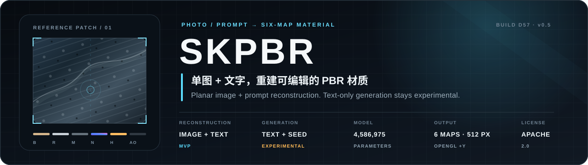
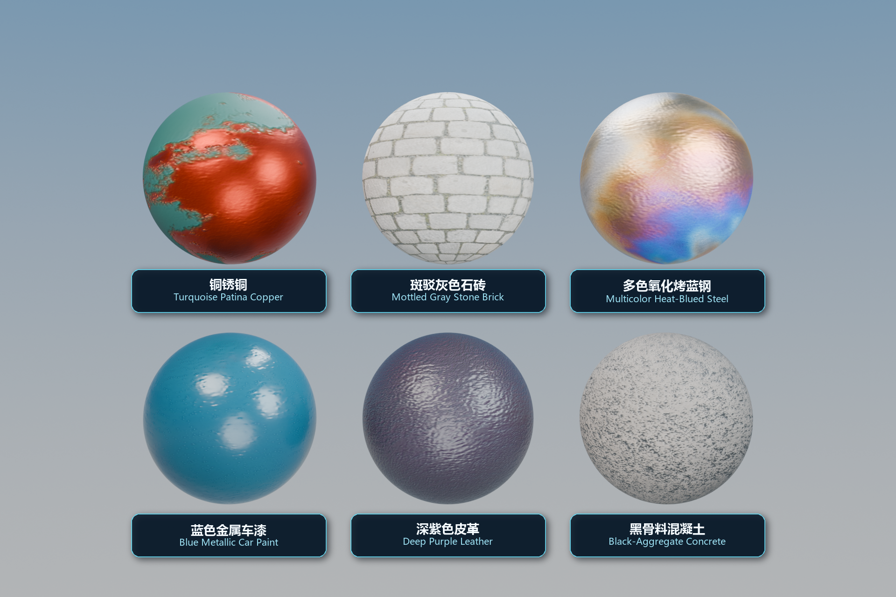
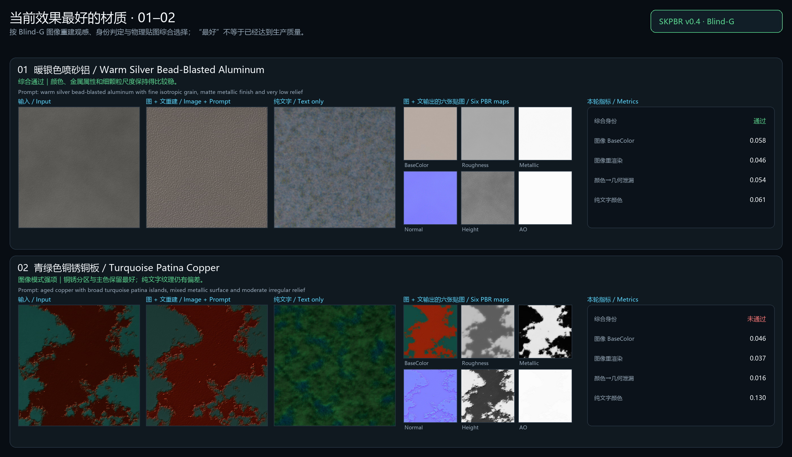
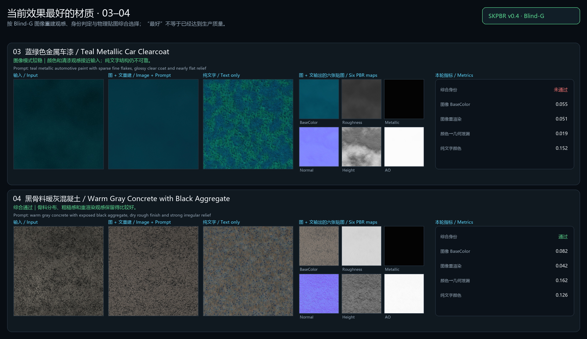
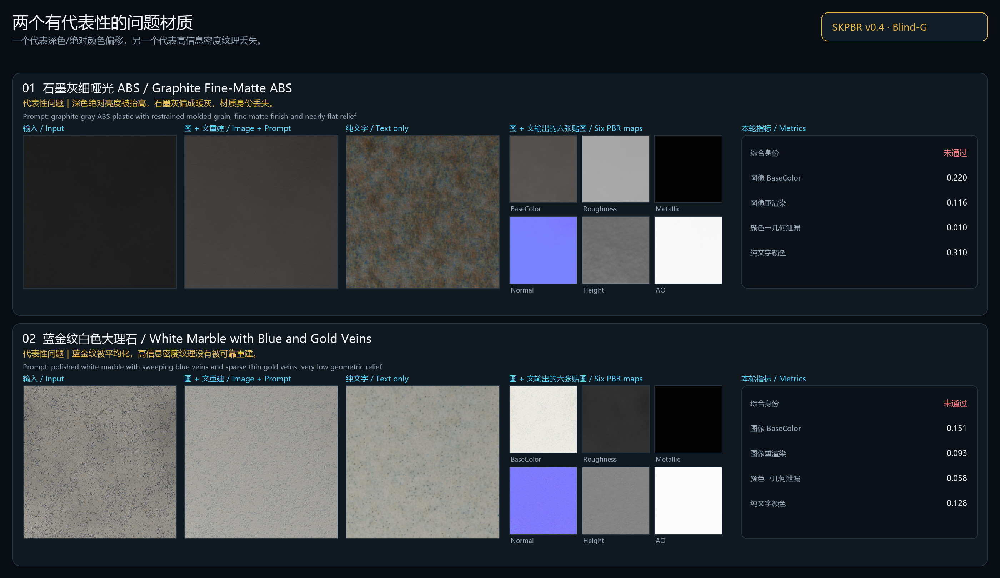

<div align="center">
  
</div>

<p align="center">
  <a href="#简体中文"><strong>简体中文</strong></a>
  &nbsp;·&nbsp;
  <a href="#english"><strong>English</strong></a>
  &nbsp;·&nbsp;
  <a href="docs/MODEL_CARD.md">Model Card</a>
  &nbsp;·&nbsp;
  <a href="examples/matsynth-90/README.md">MatSynth-90</a>
  &nbsp;·&nbsp;
  <a href="LICENSE">Apache-2.0</a>
</p>

<p align="center">
  <code>IMAGE + TEXT · RESEARCH PREVIEW</code>
  &nbsp;&nbsp;
  <code>TEXT + SEED · EXPERIMENTAL</code>
  &nbsp;&nbsp;
  <code>4,586,975 PARAMS</code>
  &nbsp;&nbsp;
  <code>512 PX · 6 MAPS</code>
</p>

<div align="center">
  <a href="docs/assets/skpbr_v05_bright_studio_2x3.png">
    
  </a>
  <br>
  <sub>同一套 Cycles 灯光下的六组 Image + Text 输出。石砖、烤蓝钢和紫色皮革来自 D57；铜锈、车漆和混凝土保留自 v0.4，用来做统一棚拍对照。此图是视觉展示，不是验收分数。</sub>
</div>

## 简体中文

SKPBR 是我拿来验证一件事的小模型：给它一张尽量平整的材质参考图，再补一句文字描述，能不能直接得到一套可以放进 Blender 或游戏引擎的 PBR 贴图。

当前 **v0.5 / D57** 有 **4,586,975 个参数**，输出六张 512px 贴图：BaseColor、Roughness、Metallic、OpenGL +Y Normal、Height 和 AO。

它现在有两条输入路径：

1. **图片 + 文字**：重建图片中可见的平面材质。这是目前更值得用的路径。
2. **纯文字 + Seed**：生成可复现的材质候选。能运行，但仍然是实验功能。

先把边界说清楚：SKPBR 还不是“随手拍一张照片就得到生产级材质”的扫描器。图片最好已经对齐、接近平面、曝光和光照比较克制；高密度纹理、复杂砖缝、细裂纹与纯文字结构仍然会失败。

### 90 材质能力验证

我们从 MatSynth 中按元数据筛选了 90 个 CC0 材质，先导入 Blender 渲染统一的平面预览，再只把预览图和“类别 + 主色”短 Prompt 交给 SKPBR。模型没有读取或复制原始 PBR 贴图；90/90 项均生成成功，共输出 540 张 512px 贴图。

在 RTX 3060、CUDA、batch 4 下，模型加载完成后的整批处理耗时 **45.934 秒**，平均 **0.510 秒/材质**；计时包含图片读取、推理和结果写盘。完整输入、九张六贴图明细、逐项来源与限制说明见 **[MatSynth 90 材质能力验证 →](examples/matsynth-90/README.md)**。

### v0.5 改了什么

D55–D57 没有增加材质库，也没有增加监督目标文件，继续使用固定的 604 个训练样本和 67 个验证样本：

| 阶段 | 做了什么 | 结果 |
|---|---|---|
| D55 | 专门修正反射率颜色和光照扰动 | 开发集 BaseColor MAE 0.05878 → 0.05622 |
| D56 | 尝试父模型锚定的几何修复 | 连续训练没有改善，最终保留 epoch 0；没有硬选更差权重 |
| D57 | 联合调整对齐的高频纹理、BaseColor 与几何适配器 | BaseColor MAE 0.05577，重渲染 MAE 0.04077 |

相对 v0.4，开发集颜色和重渲染更好，Normal 也小幅改善；但颜色到几何泄漏从 0.06158 轻微回退到 0.06198。它不是全面胜出，所以这里不写成“问题已解决”。

### 冻结后的 Blind-H6

H6 的六种目标材质是在 D57 权重冻结之后才生成的，推理只拿到一张 RGB 图和 Prompt，或只拿到 Prompt 与 Seed。模型没有读取目标贴图，也没有复制源材质。

| 检查项 | 结果 | 状态 |
|---|---:|---|
| 通过全部身份检查的材质 | 2 / 6 | 未通过；要求至少 4 种 |
| 已通过的汇总阈值 | 14 / 19 | 总体未通过 |
| 图片 BaseColor MAE | 0.09446 | 未通过；阈值 ≤ 0.090 |
| 图片 BaseColor 均值 MAE | 0.08440 | 未通过；阈值 ≤ 0.075 |
| 图片 Roughness MAE | 0.08537 | 通过 |
| 图片 Metallic MAE | 0.03544 | 通过 |
| 图片 Normal 角度误差 | 12.09° | 通过 |
| 图片重渲染 MAE | 0.04699 | 通过 |
| 颜色到几何泄漏 | 0.07451 | 通过，但接近 0.075 阈值 |
| 纯文字自相关 MAE | 0.24178 | 未通过；阈值 ≤ 0.200 |
| 纯文字条纹峰值 MAE | 0.28471 | 未通过；阈值 ≤ 0.240 |
| 金属/非金属灾难性互换 | 0 | 通过 |

结论很直接：图片模式已经能稳定给出六张可编辑贴图，材质的物理类别和重渲染通常比颜色更可靠；BaseColor 泛化和纯文字空间结构仍是下一步最该修的两件事。完整口径写在[模型卡](docs/MODEL_CARD.md)里。

<details>
<summary><strong>展开查看 v0.4 Blind-G 历史对照图</strong></summary>

这三张图是 v0.4 权重冻结后的旧盲测记录，保留用于观察版本变化，不代表 v0.5 的 H6 分数。

[](examples/blind-g/blind_g_best_01_02.png)

[](examples/blind-g/blind_g_best_03_04.png)

[](examples/blind-g/blind_g_representative_issues_01_02.png)

</details>

### 安装

需要 Python 3.10+ 和 PyTorch 2.2+。

```bash
python -m venv .venv
python -m pip install -e .
```

### 本地部署要求

下面说的是**推理**，不是训练。模型权重本身约 18.5MB，实际安装空间主要由 PyTorch 和 CUDA 运行库占用。

| 项目 | 实用建议 |
|---|---|
| 操作系统 | 64 位 Windows 10/11 或 Linux；当前发布机验证的是 Windows 11 |
| CPU | 可以只用 CPU 运行；建议使用较新的 64 位多核处理器 |
| 系统内存 | 建议至少 8GB；开发、批处理或并发请求建议 16GB |
| GPU | 可选；推荐 NVIDIA CUDA 显卡，512px 推理建议至少有 2GB 可用显存，4GB 以上更稳妥 |
| 硬盘 | CPU 环境建议预留约 2GB；CUDA 环境建议预留约 5GB，具体取决于 PyTorch 版本 |

本机 RTX 3060 的 512px 发布烟测中，图片 + 文字模式峰值 allocated / reserved 显存约为 **0.604 / 0.926 GiB**，纯文字模式约为 **0.600 / 0.928 GiB**。单套六贴图生成是十秒级，但会随显卡、驱动、PyTorch 版本、模型加载和文件写入速度变化。这是一次单请求测量，不是所有机器的硬性保证。

- `--device auto` 检测到 CUDA 时使用显卡，否则回退到 CPU；CPU 可以运行，但会更慢。
- 推理本身不需要 Blender；Blender 只用于把输出贴图渲染成材质预览。
- 依赖和权重安装完成后可以离线推理，程序不会调用云端生成 API。
- 当前正式路径是 CPU 和 NVIDIA CUDA。AMD/Intel DirectML 与 Apple MPS 尚未纳入发布测试。
- 512px 是正式评估分辨率；提高分辨率或并发数量都会增加内存与显存占用。

### 图片 + 文字重建

```bash
skpbr \
  --image material.png \
  --prompt "斑驳灰色石砖，凹陷砖缝，干燥粗糙表面" \
  --output outputs/stone_brick
```

### 纯文字候选生成

```bash
skpbr \
  --prompt "带不规则绿色铜锈的氧化铜" \
  --seed 42 \
  --output outputs/copper_candidate
```

程序不会覆盖非空目录。输出包括 `preview.png`、`inference_manifest.json`，以及 `maps/` 里的六张贴图。`--device` 支持 `auto`、`cpu` 和 `cuda`。

模型是全卷积结构，但 **512px 是正式评估分辨率**。命令行允许实验 128–1024 之间、能被 16 整除的分辨率，这不等于这些分辨率已经达到相同质量。

### 当前能力边界

目前适合：

- 对齐的平面 RGB 材质局部；
- 中英文材质描述；
- 常见非 SSS 金属、涂层、石材、混凝土、砖石、陶瓷、复合材料、软木、皮革和织物；
- 用整数 Seed 复现纯文字候选。

目前不承诺：

- 未知光照、透视、曝光或遮挡下的任意手机照片；
- 不可见 UV 区域恢复；
- 透明、SSS、毛发、皮肤、液体和体积材质；
- 绝对物理反射率测量；
- 可靠还原所有高信息密度纹理，或仅靠文字生成准确的空间布局。

### 仓库里有什么

仓库只放推理代码、冻结的 v0.5 权重、测试、一个明亮棚拍展示、精简的历史评估图，以及 MatSynth-90 的 CC0 Blender 输入预览与生成结果。训练图、目标贴图、MatSynth 原始 PBR 贴图、商业材质库、缓存、优化器状态和内部报告不随仓库发布。

### 许可证

仓库自行创作的代码和导出的 SKPBR 权重使用 [Apache License 2.0](LICENSE)。`examples/matsynth-90` 中的源预览部分来自逐项标记为 CC0 的 MatSynth 子集；来源与许可见[第三方说明](docs/THIRD_PARTY.md)和[逐项清单](examples/matsynth-90/materials.csv)。

## English

SKPBR is a small model built around one practical question: can a mostly flat material reference, plus a short description, become a usable set of PBR maps for Blender or a game engine?

The current **v0.5 / D57** checkpoint has **4,586,975 parameters** and writes six 512px maps: BaseColor, Roughness, Metallic, OpenGL +Y Normal, Height, and AO.

It has two input paths:

1. **Image + text** reconstructs the visible planar material patch. This is the useful path today.
2. **Text + seed** generates a repeatable material candidate. It runs, but it remains experimental.

The boundary matters: SKPBR is not yet a “casual phone photo in, production material out” scanner. The image should be aligned, close to planar, and reasonably controlled in exposure and lighting. Dense veins, cracks, brick layouts, and text-only spatial structure can still fail.

### 90-material capability check

We selected 90 MatSynth materials whose metadata reports CC0, imported them into Blender to render consistent planar previews, and gave SKPBR only each preview plus a short category-and-color Prompt. The model did not read or copy the original PBR maps. All 90 items completed, producing 540 maps at 512px.

On an RTX 3060 with CUDA and batch 4, the warm-model batch took **45.934 seconds**, or **0.510 seconds/material**, including image reads, inference, and output writes. See the **[MatSynth 90-material capability check →](examples/matsynth-90/README.md)** for the inputs, nine detailed six-map sheets, per-item provenance, and limitations.

### What changed in v0.5

D55–D57 added no material libraries or supervised target files. Training stayed on the fixed 604-row train and 67-row validation sets.

| Stage | Change | Result |
|---|---|---|
| D55 | reflectance-color recovery under lighting perturbations | development BaseColor MAE 0.05878 → 0.05622 |
| D56 | parent-anchored geometry remediation | trained epochs did not improve validation, so epoch 0 was retained |
| D57 | joint aligned high-frequency, BaseColor, and geometry adapter tuning | BaseColor MAE 0.05577; rerender MAE 0.04077 |

Against v0.4, development color and rerendering improved and Normal moved slightly forward. Color-to-geometry leakage, however, moved from 0.06158 to 0.06198. This is a better checkpoint in selected areas, not a claim that the problem is solved.

### Post-freeze Blind-H6

The six H6 targets were created only after D57 was frozen. Inference received one RGB image plus Prompt, or Prompt plus seed. It never received target maps or copied a source material.

| Check | Result | Status |
|---|---:|---|
| Materials passing every identity check | 2 / 6 | Not passed; at least 4 required |
| Aggregate thresholds passed | 14 / 19 | Overall result not passed |
| Image BaseColor MAE | 0.09446 | Not passed; threshold ≤ 0.090 |
| Image BaseColor mean MAE | 0.08440 | Not passed; threshold ≤ 0.075 |
| Image Roughness MAE | 0.08537 | Passed |
| Image Metallic MAE | 0.03544 | Passed |
| Image Normal angular error | 12.09° | Passed |
| Image rerender MAE | 0.04699 | Passed |
| Color-to-geometry leakage | 0.07451 | Passed, close to the 0.075 threshold |
| Text autocorrelation MAE | 0.24178 | Not passed; threshold ≤ 0.200 |
| Text stripe-peak MAE | 0.28471 | Not passed; threshold ≤ 0.240 |
| Catastrophic metal/non-metal swaps | 0 | Passed |

In short: image mode reliably produces six editable maps, and physical regime plus rerendering are usually stronger than exact color. BaseColor generalization and text-only spatial structure remain the two clearest problems. See the [model card](docs/MODEL_CARD.md) for the full evaluation contract.

<details>
<summary><strong>Expand the historical v0.4 Blind-G boards</strong></summary>

These are retained as version-history references. They are not the v0.5 H6 score.

[](examples/blind-g/blind_g_best_01_02.png)

[](examples/blind-g/blind_g_best_03_04.png)

[](examples/blind-g/blind_g_representative_issues_01_02.png)

</details>

### Install

Python 3.10+ and PyTorch 2.2+ are expected.

```bash
python -m venv .venv
python -m pip install -e .
```

### Local deployment requirements

The figures below describe **inference**, not training. The checkpoint itself is about 18.5MB; PyTorch and the CUDA runtime account for most of the installed size.

| Item | Practical guidance |
|---|---|
| Operating system | 64-bit Windows 10/11 or Linux; the current release machine is Windows 11 |
| CPU | CPU-only inference is supported; a recent 64-bit multicore processor is recommended |
| System memory | 8GB recommended; 16GB for development, batching, or concurrent requests |
| GPU | Optional; NVIDIA CUDA is recommended, with at least 2GB of free VRAM for 512px inference and 4GB+ for comfortable headroom |
| Disk | Reserve about 2GB for a CPU environment or 5GB for a CUDA environment, depending on the PyTorch build |

In the 512px release smoke test on the local RTX 3060, image + text peaked at approximately **0.604 / 0.926 GiB allocated / reserved VRAM**. Text-only inference peaked at **0.600 / 0.928 GiB**. A complete six-map request is on the order of seconds to tens of seconds, depending on GPU, driver, PyTorch build, model loading, and file I/O. These are single-request measurements, not hard guarantees for every machine.

- `--device auto` uses CUDA when available and otherwise falls back to CPU. CPU works, but is slower.
- Blender is not required for inference; it is only needed to render the output maps as a material preview.
- Once dependencies and weights are installed, inference can run offline and does not call a cloud generation API.
- The released paths are CPU and NVIDIA CUDA. AMD/Intel DirectML and Apple MPS are not part of the current test matrix.
- 512px is the evaluated resolution. Higher resolutions and concurrent requests increase memory and VRAM use.

### Image + text reconstruction

```bash
skpbr \
  --image material.png \
  --prompt "mottled gray stone brick with recessed joints and a dry rough finish" \
  --output outputs/stone_brick
```

### Text-only candidate generation

```bash
skpbr \
  --prompt "oxidized copper with irregular green patina" \
  --seed 42 \
  --output outputs/copper_candidate
```

The command refuses to overwrite a non-empty directory. It writes `preview.png`, `inference_manifest.json`, and six images under `maps/`. `--device` accepts `auto`, `cpu`, and `cuda`.

The network is fully convolutional, but **512px is the evaluated release resolution**. Other multiples of 16 from 128 to 1024 are exposed for experiments, not as a quality promise.

### Current boundary

Reasonable research-preview use:

- aligned planar RGB material crops;
- English or Chinese material descriptions;
- common non-SSS metals, coatings, stone, concrete, masonry, ceramic, composites, cork, leather, and textiles;
- deterministic text-only candidates through an integer seed.

Not established:

- arbitrary phone photos with unknown lighting, perspective, exposure, or occlusion;
- hidden UV recovery;
- transparency, SSS, hair, skin, liquids, or volumes;
- absolute physical reflectance measurement;
- reliable recovery of every high-information texture or accurate spatial layouts from text alone.

### What is published

The repository contains inference code, the frozen v0.5 checkpoint, tests, one bright studio gallery, compact historical evaluation images, and the CC0 Blender input previews plus generated results for MatSynth-90. Training images, target maps, original MatSynth PBR maps, commercial material libraries, caches, optimizer states, and internal reports are not distributed.

### License

Repository-authored code and the exported SKPBR checkpoint use the [Apache License 2.0](LICENSE). Source-preview portions under `examples/matsynth-90` derive from a MatSynth subset whose per-item metadata reports CC0; see the [third-party notice](docs/THIRD_PARTY.md) and [item manifest](examples/matsynth-90/materials.csv).
