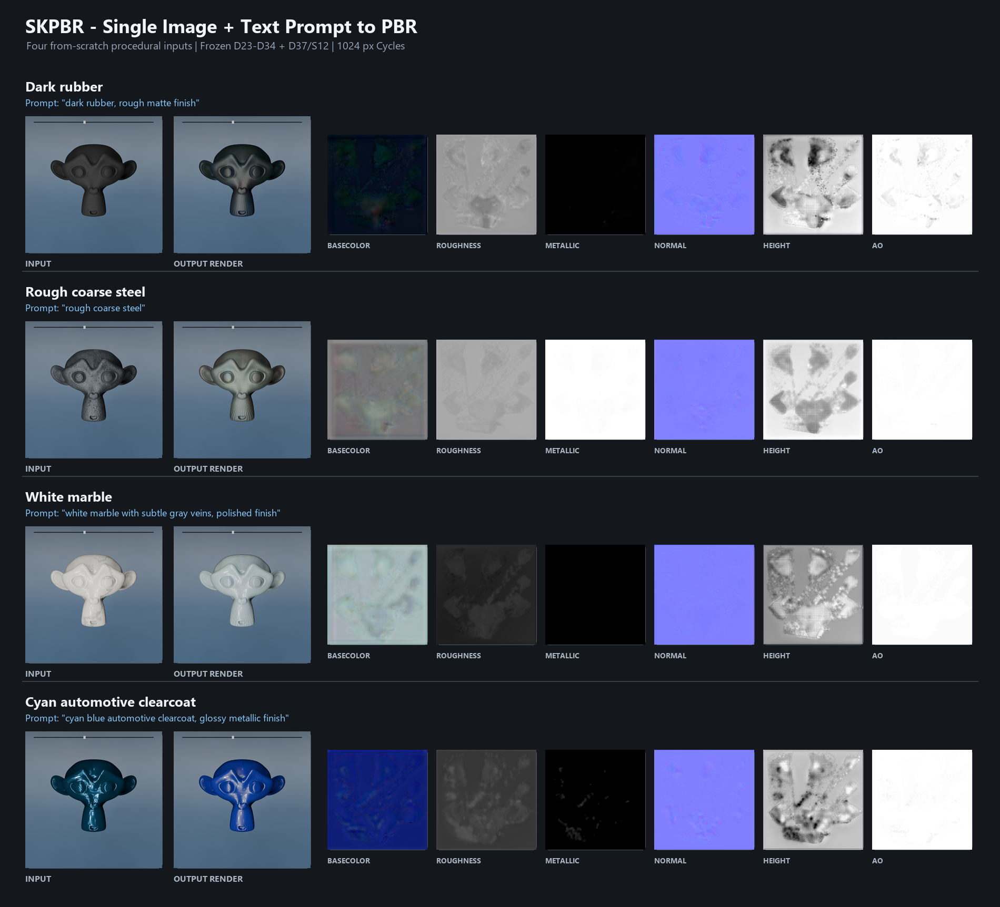

# SKPBR

[English](README.md) | **简体中文**

> **SKPBR 是一个 266,241 参数的单图+Prompt BaseColor 校准模型，可在受控 Suzanne/Light-Stage 输入和冻结父 PBR 的前提下生成 1024px BaseColor、原样保留 Roughness/Metallic/Normal/Height/AO，但不支持任意照片、任意几何或生产级通用材质重建。**

SKPBR v0.1 是研究预览版。本仓库只发布能够独立审计的最终 BaseColor 校准头，不把完整上游系统错误描述为一个 26.6 万参数的端到端模型。

这个项目最初是为作者自己的游戏项目开发的实验性材质工具。

## 输入与输出

输入包括一张 RGB 参考渲染图、一段英文材质 Prompt、一套冻结父 PBR 预测和一张可见 UV 置信度图。输出为新的 BaseColor；Roughness、Metallic、Normal、Height 和 AO 从父预测逐文件原样复制。

这些贴图对应已知物体 UV，不保证能作为任意模型上的无缝平铺材质。

## 安装

```bash
python -m venv .venv
python -m pip install -e .
```

## 使用

父 PBR 文件夹需要包含 `basecolor.png`、`roughness.png`、`metallic.png`、`normal.png`、`height.png` 和 `ao.png`。

```bash
skpbr \
  --image reference.png \
  --prompt "dark rough cast iron" \
  --parent-dir parent_pbr \
  --visible-confidence visible_confidence.png \
  --output outputs/cast_iron
```

## 四组如实公开的示例

下面四种材质均由全新的程序化配方从零生成，并以 Blender Cycles 在 Suzanne 上进行 1024px 渲染。推理时只向模型提供渲染后的 RGB 图和对应英文 Prompt。示例实际经过完整冻结研究管线；本仓库的公开包只包含其最终 266,241 参数 S12 校准头，因此公开 CLI 仍需要父 PBR 输入。



[点击查看全分辨率输入、Prompt、输出渲染图和全部六张 PBR 贴图。](examples/README_zh-CN.md)

这些是未经美化和后处理的真实模型结果，不是挑选出的真值。图中如实保留了当前问题：周期性 UV/投影点阵、白色大理石细脉恢复较弱、粗钢偏浅偏绿，以及青蓝车漆向高饱和蓝色偏移。

## 已验证能力

- 单图 + Prompt 条件输入；
- 1024px BaseColor 残差校准；
- 其他五张 PBR 图逐文件无损保留；
- 266,241 参数；
- 本地 CPU 或 CUDA 推理；
- 最终校准头的屏幕替换一致性误差为 0；
- 运行时不读取训练材质、目标贴图或近邻素材库。

## 已知限制

- 公开包不包含 RGB 到父 PBR 的上游模型；
- 仅在受控 Suzanne、固定 UV 和 Light-Stage 风格输入上进行了主要验证；
- 不支持任意手机照片、任意几何或生产级自动交付；
- 不支持 SSS、透明、毛发、皮肤、流体及体积材质；
- 当前 Prompt 解析器只承诺英文关键词兼容；
- 一次性外部盲测 11 个门槛中有 3 个未通过，因此只能作为研究预览。

盲测中，SKPBR 的 BaseColor MAE 为 `0.08935`，比未校准父输出改善约 53.3%，但比冻结 D36 基线高 22.9%；高频细节相关性为 `0.96742`，身份泄漏为 0。

## 数据与隐私

除上述四组全新生成的程序化公开示例外，仓库不包含训练/评估图片、原始 PBR、商业素材、训练缓存、优化器状态、本地绝对路径和逐样本盲测记录。权重是仅包含张量的 `state_dict`，运行时使用 `weights_only=True` 加载。

代码与导出的 SKPBR 权重使用 [MIT License](LICENSE)。MIT 不授予任何第三方训练或参考素材的再分发权；这些素材没有包含在仓库中。

模型卡、数据政策、发布审计及其他技术资料统一收录在 [文档目录](docs/README.md)。
