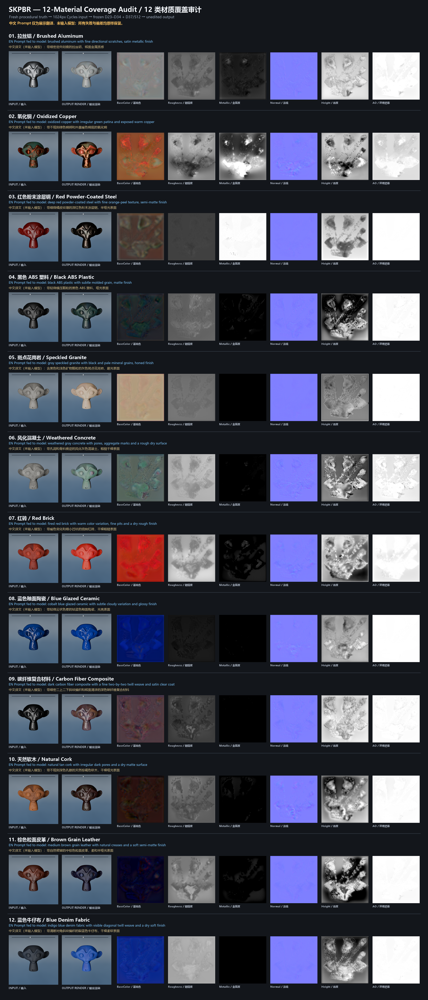

# SKPBR Current Material Coverage Audit (12 Cases)

> Historical v0.1 Suzanne audit. The v0.2 planar D38-D41 result is documented in the root README and technical HTML report.

**English** | [简体中文](COVERAGE_AUDIT_12_zh-CN.md)

## Executive conclusion

The frozen SKPBR pipeline can produce a complete set of six 1024 px PBR maps from a controlled Suzanne / Light-Stage input, but it **cannot yet be described as a general reconstructor for all common materials**. Blue glazed ceramic and red brick are relatively close to the inputs. Oxidized copper, cork, and denim capture only part of the dominant identity. Brushed aluminum, red powder-coated steel, black ABS, granite, concrete, carbon fiber, and leather show clear identity or color failures. A render that still resembles “some material” is not a physical reconstruction success when Metallic, Height, or another physical map is wrong.

The honest boundary is therefore: **a research PBR candidate generator for a controlled Suzanne image plus an English Prompt**. It is useful for demos, failure analysis, and further training, but not for promises about arbitrary photos, arbitrary geometry, seamless materials, or production-grade reconstruction.

The long sheet is also available as three exact pixel crops. Concatenating them reproduces the main image pixel-for-pixel:

- [Cases 1–4](../examples/coverage-12/contact_sheet_part_01.png)
- [Cases 5–8](../examples/coverage-12/contact_sheet_part_02.png)
- [Cases 9–12](../examples/coverage-12/contact_sheet_part_03.png)

## Why these 12 cases

The frozen R1 catalog records 73 active families. Those families collapse into six main physical superclasses, so this audit uses at most 12 representatives to cover the major boundaries rather than spending most slots on similar metals.

| # | Material | Coverage boundary |
|---:|---|---|
| 1 | Brushed Aluminum / 拉丝铝 | Bare metal and directional microstructure |
| 2 | Oxidized Copper / 氧化铜 | Mixed metalness and corrosion layer |
| 3 | Red Powder-Coated Steel / 红色粉末涂层钢 | Dielectric coating over a metal substrate |
| 4 | Black ABS Plastic / 黑色 ABS 塑料 | Polymer and molded micrograin |
| 5 | Speckled Granite / 斑点花岗岩 | Dense stone with multiple mineral grains |
| 6 | Weathered Concrete / 风化混凝土 | Construction material, pores, and aggregate |
| 7 | Red Brick / 红砖 | Masonry and fired porous surface |
| 8 | Blue Glazed Ceramic / 蓝色釉面陶瓷 | Ceramic body and glossy glaze |
| 9 | Carbon Fiber Composite / 碳纤维复合材料 | Directional engineered composite and clear coat |
| 10 | Natural Cork / 天然软木 | Porous cork within the cork/leather superclass |
| 11 | Brown Grain Leather / 棕色粒面皮革 | Grain, creases, and soft highlights |
| 12 | Blue Denim Fabric / 蓝色牛仔布 | Textile and directional twill weave |

`SP026 Ground Sand` remains marked `reference_only` in the frozen catalog and is not part of the 73 active training families, so this audit does not misrepresent sand as a validated capability. Lace and open mesh are also excluded because the current six-map contract cannot express real cutouts without opacity.

## Protocol

- Every source material was generated from a new numerical procedural recipe and an independent deterministic seed. No training texture, validation/test target, Substance/commercial asset, nearest-neighbor catalog, previous four-case source, or previous output was read.
- Each source contains BaseColor, Roughness, Metallic, Normal, Height, and AO at 1024 × 1024.
- Inputs were rendered in the same Suzanne Light-Stage scene using Blender Cycles, 64 samples, AgX, exposure 0, and 1024 × 1024 RGB.
- The model received only that RGB image and the English Prompt printed in the sheet. The Chinese Prompt is a display translation and **was not fed to the model**.
- The actual frozen chain was D23 → D30/D31 → D32/D33/D34 → D37/S12. Outputs are not hand-authored substitutes, and no weights were tuned after seeing the cases.
- Outputs were rendered in Cycles at 1024 px with no grading, retouching, beautification, or failure hiding.
- Procedural truth was read only after inference for post-hoc MAE. Runtime source/target map reads were zero.

## Quantitative results

MAE is measured in decoded `[0,1]` map space. It is a diagnostic for these 12 novel procedural cases, not a broad benchmark claim.

| # | Routed archetype | Prompt compatibility | BaseColor | Roughness | Metallic | Normal | Height | AO |
|---:|---|---:|---:|---:|---:|---:|---:|---:|
| 1 | bare_metal | 0.999977 | 0.0576 | 0.0518 | **0.8422** | 0.0320 | 0.2443 | 0.0189 |
| 2 | rusted_metal | 0.000213 | 0.1664 | 0.2461 | **0.4737** | 0.0461 | 0.0957 | 0.0891 |
| 3 | bare_metal | 0.000119 | 0.1655 | 0.1392 | **0.9860** | 0.0148 | 0.3731 | 0.0030 |
| 4 | plastic_rubber | 0.000313 | 0.1047 | 0.0870 | 0.0079 | 0.0134 | **0.4687** | 0.0074 |
| 5 | porous_stone | 0.968665 | 0.1808 | 0.0699 | 0.0000 | 0.0359 | 0.1837 | 0.0111 |
| 6 | concrete_asphalt | 0.000145 | 0.0736 | 0.0747 | 0.0029 | 0.0553 | 0.0623 | 0.0593 |
| 7 | masonry_plaster | 0.000343 | 0.1010 | 0.0942 | 0.0365 | 0.0497 | 0.0619 | 0.0331 |
| 8 | ceramic | 0.000122 | **0.0485** | 0.0799 | 0.0002 | 0.0070 | 0.0538 | 0.0028 |
| 9 | engineered_composite | 0.000126 | **0.2297** | 0.1053 | 0.1331 | 0.0231 | 0.1389 | 0.0099 |
| 10 | paint_coating (misrouted) | 0.999990 | 0.1700 | **0.3356** | 0.0086 | 0.0446 | 0.0511 | 0.0285 |
| 11 | paint_coating (misrouted) | 0.999990 | 0.1316 | 0.0543 | 0.0174 | 0.0262 | **0.4518** | 0.0098 |
| 12 | paint_coating (misrouted) | 0.000338 | 0.1808 | 0.0399 | 0.0000 | 0.0343 | 0.2194 | 0.0258 |

Mean MAE across the 12 cases is approximately BaseColor 0.1342, Roughness 0.1148, Metallic 0.2090, and Height 0.2004. Metallic is dominated by the brushed-aluminum, oxidized-copper, and powder-coating failures.

## Per-case visual assessment

1. **Brushed aluminum:** clear failure. The dark directional metal input becomes an overly pale, almost uniform silver surface; brushing weakens and Metallic is severely wrong.
2. **Oxidized copper:** copper/green regions are generated, but the render is dominated by exposed copper and loses patina coverage and roughness layering.
3. **Red powder-coated steel:** major failure. Deep red becomes nearly black metal; the Prompt is routed as `bare_metal`, while a visible powder coat should be dielectric.
4. **Black ABS:** black shifts toward teal/green and molded grain is replaced by projection residuals. Metalness remains broadly non-metallic, but color is unacceptable.
5. **Speckled granite:** output becomes pale and warm; black and light mineral grains largely disappear into a uniform plaster-like stone.
6. **Weathered concrete:** global gray statistics are not the worst, but visible cyan/magenta artifacts and Suzanne projection dots replace reliable pores and aggregate.
7. **Red brick:** the red material class is retained and this is one of the better cases, but output is brighter, more saturated, smoother, and contains unwanted Metallic residue.
8. **Blue glazed ceramic:** the best case. Cobalt blue and glossy appearance remain broadly consistent and BaseColor MAE is lowest; UV/projection structure still prevents seamless reuse.
9. **Carbon fiber:** major failure. Black weave becomes reddish brown, the two-by-two twill is not preserved, and coating/Metallic relationships are inaccurate.
10. **Natural cork:** partially captures a warm brown porous class, but tan shifts to dark brown, pores and dry roughness weaken, and text is misrouted to `paint_coating`.
11. **Brown grain leather:** brown shifts strongly toward blue/purple, grain and crease structure disappear, and text is also misrouted.
12. **Blue denim:** partially captures blue color and a regular weave, but indigo becomes highly saturated bright blue, the twill is incomplete, and soft fiber behavior is missing. It is misrouted to `paint_coating`.

## Main findings

1. **Text routing is incomplete.** Cork, leather, and denim route to coating, while powder-coated steel routes to bare metal. Training-family inventory does not mean the Prompt front end can actually invoke those families.
2. **Prompt compatibility is uncalibrated.** Cork and leather score about 0.99999 despite wrong routing and visible failure, while the best ceramic case scores only 0.000122.
3. **Color remains the first-order weakness.** Red coating, black ABS, carbon fiber, leather, and denim all show obvious hue or saturation shifts.
4. **High-information texture is not recovered reliably.** Patina distribution, mineral grains, carbon weave, leather grain, and denim twill are weakened or replaced by projection residuals.
5. **Outputs remain tied to visible Suzanne UV.** Maps visibly contain the Suzanne silhouette, visibility regions, and periodic dot patterns. They are not clean seamless materials for arbitrary geometry.
6. **Physical maps can fail catastrophically.** Metal, mixed corrosion, and dielectric coating are confused most severely in Metallic topology.

## Resource, integrity, and privacy audit

- Full-chain CUDA allocated peak: **4.266 GiB**.
- Whole-device sampled VRAM peak: **5.651 GiB**.
- Hard limit: **8.0 GiB, passed**.
- All 12 × 6 predicted maps, 12 inputs, and 12 output renders are 1024 × 1024.
- Original Blender input/output PNGs embed local scene-path metadata. Originals remain internal; copies under `public_candidate/` remove only PNG text/EXIF metadata. Every decoded image passes `numpy.array_equal == true`, with matching before/after decoded-pixel SHA256 values.
- Public-candidate JSON and text contain no absolute paths or private tokens. Internal runtime manifests contain local paths and are explicitly excluded from the candidate.
- Full SHA256, dimension, decoded-pixel identity, and privacy evidence is in the [delivery audit](release/coverage_12_delivery_audit.json).

## Recommended next steps

1. Fix the Prompt lexicon/lightweight text encoder with explicit `cork/leather/textile/powder coating` routing and bilingual synonym tests.
2. Add an explicit metal / mixed-corrosion / dielectric-coating discrete head with physical consistency constraints.
3. Specialize BaseColor supervision with visible-region chroma statistics, hue/saturation loss, and difficult red/black/brown/indigo pairs.
4. Add patch correspondence plus spectral/directional supervision for patina, granite, carbon fiber, leather, and denim without learning the Suzanne silhouette.
5. Add at least a second geometry and true seamless/unseen-UV evaluation before making any general-material claim.
