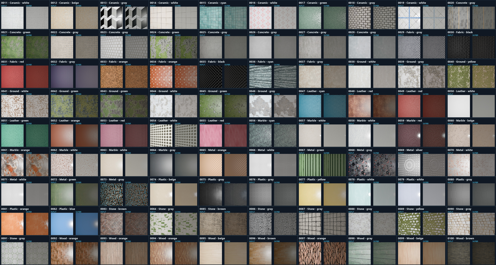

# MatSynth 90 材质能力验证 / MatSynth 90-Material Capability Check

[简体中文](#简体中文) · [English](#english) · [材料与来源清单](materials.csv) · [运行清单](benchmark.json)

## 简体中文

这是一次覆盖面检查，不是带真值贴图评分的定量基准。我们从 [MatSynth](https://huggingface.co/datasets/gvecchio/MatSynth) 中按元数据筛选了 **90 个 CC0 材质**，覆盖陶瓷、混凝土、织物、地表、皮革、大理石、金属、塑料、石材和木材 10 类，每类 9 个。

### 测试流程

1. 将 MatSynth 原始 PBR 材质导入 Blender，在统一场景中渲染平面预览图。
2. 只把渲染后的 RGB 预览图，以及由“类别 + 主色”组成的短 Prompt 交给 SKPBR v0.5。
3. 模型以图片 + 文字模式生成 BaseColor、Roughness、Metallic、OpenGL +Y Normal、Height 和 AO 六张 512px 贴图。
4. 推理过程不读取 MatSynth 原始 PBR 贴图，也不按材质名称检索或复制源文件。下方 Output 是 SKPBR 的解析平面预览；按照本轮要求，没有再用 Blender 重渲染模型输出。

### 结果总览

每格左侧为输入，右侧为 SKPBR 输出预览。90/90 项成功生成，共得到 540 张贴图和 90 张预览图。

原始 Blender 输入预览总表：[查看大图](images/input_contact_sheet.png)。

<strong>展开查看 90 项六贴图明细</strong>

- [0011–0020](images/details/details_0011_0020.jpg)
- [0021–0030](images/details/details_0021_0030.jpg)
- [0031–0040](images/details/details_0031_0040.jpg)
- [0041–0050](images/details/details_0041_0050.jpg)
- [0051–0060](images/details/details_0051_0060.jpg)
- [0061–0070](images/details/details_0061_0070.jpg)
- [0071–0080](images/details/details_0071_0080.jpg)
- [0081–0090](images/details/details_0081_0090.jpg)
- [0091–0100](images/details/details_0091_0100.jpg)

### 生成速度

| 项目 | 实测值 |
|---|---:|
| GPU | NVIDIA GeForce RTX 3060 |
| 模式 | CUDA，512px，batch 4 |
| 生成数量 | 90 套 × 6 张贴图 |
| 总耗时 | 45.934 秒 |
| 平均速度 | 0.510 秒/材质 |
| 整卡峰值显存 | 4.666 GiB |

计时从模型加载完成后开始，包含输入读取、批量推理、六贴图/预览图/JSON 写盘；因此它是一次热模型批处理吞吐测试，不是单张冷启动延迟。

### 能看出什么

- 规则砖缝、编织纹理、木纹和大范围颜色通常能进入 BaseColor、Normal 与 Height。
- 强高光和原图明暗仍可能被写进 BaseColor 或几何贴图。
- v0.5 的 Prompt 分类器没有独立木材类，本轮木材暂时映射到最接近的软木类，因此这部分主要验证图像分支，不代表木材语义已经解决。
- 本轮没有用 MatSynth 真值贴图计算 MAE、PSNR 或重渲染误差，所以这里展示的是覆盖面和稳定性，不能当作物理精度排名。

完整的 90 项名称、来源、链接、许可和实际 Prompt 见 [`materials.csv`](materials.csv)；检查点哈希、显存、耗时和防作弊约束见 [`benchmark.json`](benchmark.json)。

### 来源与许可

MatSynth 由 Giuseppe Vecchio 与 Valentin Deschaintre 发布；项目数据卡说明完整数据集含 CC0 与 CC-BY 来源。本案例只选择元数据明确标记为 **CC0** 的 90 项。原始 PBR 贴图没有随本仓库再分发，仓库内只保留由这些 CC0 材质得到的 Blender 输入预览、SKPBR 输出和对照图。详见[第三方说明](../../docs/THIRD_PARTY.md)与 [MatSynth 论文](https://arxiv.org/abs/2401.06056)。

## English

This is a coverage check, not a ground-truth-scored benchmark. We selected **90 CC0 materials** from [MatSynth](https://huggingface.co/datasets/gvecchio/MatSynth): nine each from Ceramic, Concrete, Fabric, Ground, Leather, Marble, Metal, Plastic, Stone, and Wood.

### Protocol

1. The original MatSynth PBR materials were imported into Blender and rendered as planar previews under one consistent setup.
2. SKPBR v0.5 received only each rendered RGB preview plus a short category-and-dominant-color Prompt.
3. Image + Text inference produced six 512px maps: BaseColor, Roughness, Metallic, OpenGL +Y Normal, Height, and AO.
4. Inference did not read, retrieve, or copy the source PBR maps. The Output panels below use SKPBR's analytic plane preview; the generated maps were not rerendered in Blender for this run.

### Overview

Input is on the left of each cell and the SKPBR preview is on the right. All 90 items completed, producing 540 maps and 90 previews.

The complete Blender input-preview sheet is available [here](images/input_contact_sheet.png). The nine detailed six-map sheets are linked in the expandable section above.

### Throughput

| Item | Measured result |
|---|---:|
| GPU | NVIDIA GeForce RTX 3060 |
| Mode | CUDA, 512px, batch 4 |
| Output | 90 materials × 6 maps |
| Total time | 45.934 s |
| Average | 0.510 s/material |
| Peak whole-device VRAM | 4.666 GiB |

Timing starts after model loading and includes input decoding, batched inference, and map/preview/JSON writes. It is warm-model batch throughput, not cold-start single-request latency.

### Reading the result

- Regular masonry, weave, wood grain, and broad color structure are often preserved across BaseColor, Normal, and Height.
- Strong highlights and input shading can still leak into BaseColor or geometry maps.
- v0.5 has no dedicated Wood Prompt class, so Wood was mapped to the nearest Cork class. These rows mainly test the image branch.
- No MatSynth target map was used to compute MAE, PSNR, or rerender error, so this is evidence of coverage and stability rather than a physical-accuracy ranking.

See [`materials.csv`](materials.csv) for all sample names, upstream sources, links, licenses, and inference Prompts. See [`benchmark.json`](benchmark.json) for the checkpoint hash, timing, memory, and anti-copy conditions.

### Source and license

MatSynth was published by Giuseppe Vecchio and Valentin Deschaintre. Its full dataset contains both CC0 and CC-BY sources; this check uses only 90 entries whose metadata explicitly reports **CC0**. Original source PBR maps are not redistributed here. The repository contains only Blender input previews derived from that CC0 subset, SKPBR outputs, and comparison boards. See the [third-party notice](../../docs/THIRD_PARTY.md) and the [MatSynth paper](https://arxiv.org/abs/2401.06056).
